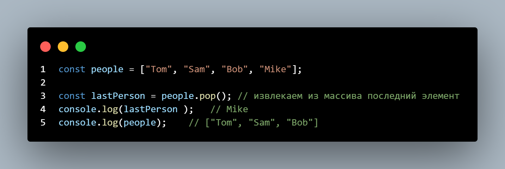

## Для хранения набора данных в языке JavaScript предназначены массивы. Массивы в JavaScript представлены объектом Array. Объект Array предоставляет ряд свойств и методов, с помощью которых мы можем управлять массивом и его элементами.

# Создание массива

### Можно создать пустой массив, используя квадратные скобки или конструктор Array: 

### Можно сразу же инициализировать массив некоторым количеством элементов:

### Можно определить массив и по ходу определять в него новые элементы:

### concat(): объединяет элементы двух массивов в один массив

### filter(): фильтрует элементы массива

### find(): возвращает первый элемент массива, который соответствует некоторому условию

### forEach(): применяет определенную функцию к каждому элементу массива

### includes(): проверяет, есть ли в массиве значение

### indexOf(): возвращают индекс первого включения элемента в массиве.

### map(): преобразует каждый элемент массива в другое значение на основе функции преобразования (проекция элементов)

### pop(): удаление элемента с конца массива

### push(): добавление элемента в конец массива

### reduce(): объединяет элементы массива в одно значение

### reverse(): располагает элементы массива в обратном порядке

### shift(): удаляет первый элемент массива

### unshift(): добавляет новый элемент в начало массива

### slice(): вырезает отдельные элементы из массива

### splice(): добавление элементы на определенную позицию в массиве

### sort(): сортирует массив 

### some(): проверяет, соответствует ли хотя бы один элемент условию

### join(): объединяет элементы массива в строку

### every(): проверяет, все ли элементы соответствуют определенному условию

### findLast(): возвращает последний элемент, который соответствует условию

### findIndex(): возвращает индекс первого элемента массива, который соответствует некоторому условию

### findLastIndex(): возвращает индекс последнего элемента, который соответствует условию

### flat(): упрощает структуру вложенных элементов массива.

